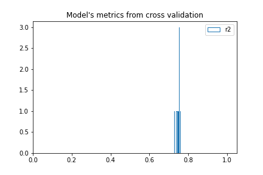
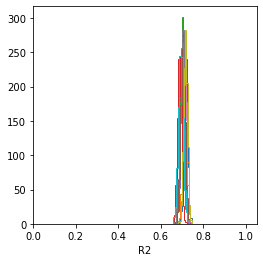

## Оценка модели по распределению метрик с применением Bootstrap

Один из вариантов оценки модели это скользящий контроль. Но такой подход не позволяет оценть распределение метрик. 
Поэтому используют следующий подход. 

После скользящего контроля выходы модели многократно семплируют любым из известных распределений - Пуассона, биномиальным или мультиномиальным.
И уже используя данные выходы оценивают распеределение метрик - среднее, медиану, определяют доверительный интрвал и т.п.

В данном коде приведен пример того как проводить такую оценку для рагрессии и классификации. При этом используется самопальный алгоритм GBM.

R2 для задачи регрессии по скользящему контролю. Как видим всего 10 точек. Распределение не оценить.

Но вот результаты многократного семплирования выходов. Можно легко оценить среднюю по R2 и её дисперсию. Тем самым можно узнать устойчивость модели и сравнить с другим решением.

